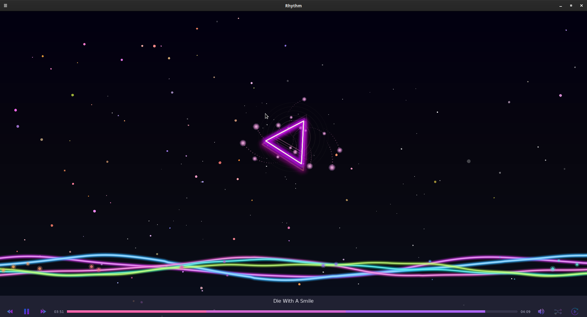

<div align="center">
  
  
  # Rhythm
  
  **A modern Linux music player with stunning visualizations**
  
  [](https://opensource.org/licenses/MIT)
  [](https://en.wikipedia.org/wiki/C11_(C_standard_revision))
  [](https://www.lua.org/)
  [](https://www.linux.org/)
  [](https://cmake.org/)
  [](https://love2d.org/)
  [](http://www.portaudio.com/)
  [](https://www.mpg123.de/)
  
  
</div>

## ✨ Features

- 🎵 **Multi-Format Support** - Play MP3, FLAC, and other popular audio formats
- 🌈 **Stunning Visualizations** - Real-time spectrum analyzer with beautiful effects
- 🎮 **Dual Interface** - Choose between CLI for simplicity or GUI for rich experience
- 🐧 **Linux Native** - Optimized for Linux systems with native performance
- 📁 **Smart Playlist Management** - Load single files or entire directories
- 🔀 **Advanced Playback** - Shuffle, repeat modes, and seamless track transitions
- ⚡ **High Performance** - Native C core with optimized audio processing
- 🎨 **Modern UI** - Clean, responsive interface built with LÖVE2D
- 🎛️ **Intuitive Controls** - Keyboard shortcuts and mouse interaction

## 🖥️ System Requirements

- **OS**: Linux (Ubuntu, Fedora, Arch, openSUSE)
- **Architecture**: x86_64
- **Dependencies**: PortAudio, mpg123, LÖVE2D (for GUI)
- **Memory**: ~100MB RAM usage
- **Disk**: ~20MB installation size

## 🚀 Quick Start

### What is LÖVE2D?

LÖVE2D (also known as "Love") is a 2D game framework for Lua. We use it to create the beautiful GUI interface for Rhythm. The command `love gui` tells LÖVE2D to run the application in the `gui` directory.

### Install Dependencies

**Ubuntu/Debian:**
```bash
# Core dependencies for CLI
sudo apt update && sudo apt install -y \
    portaudio19-dev libmpg123-dev cmake build-essential

# For GUI support, install LÖVE2D
sudo apt install -y love
```

**Fedora/RHEL:**
```bash
# Core dependencies for CLI
sudo dnf install -y \
    portaudio-devel mpg123-devel cmake gcc

# For GUI support, install LÖVE2D
sudo dnf install -y love
```

**Arch Linux:**
```bash
# Core dependencies for CLI
sudo pacman -S \
    portaudio mpg123 cmake gcc

# For GUI support, install LÖVE2D
sudo pacman -S love
```

**Alternative LÖVE2D Installation:**
If LÖVE2D is not available in your package manager, download from [love2d.org](https://love2d.org/):
```bash
# Download and install LÖVE2D AppImage (works on most Linux distros)
wget https://github.com/love2d/love/releases/download/11.4/love-11.4-x86_64.AppImage
chmod +x love-11.4-x86_64.AppImage
sudo mv love-11.4-x86_64.AppImage /usr/local/bin/love
```

### Build from Source

```bash
# Clone the repository
git clone https://github.com/your-username/rhythm.git
cd rhythm

# Build the project
mkdir build && cd build
cmake ..
make

# Install (optional)
sudo make install
```

## 🎮 Usage

### CLI Mode (Terminal)

**Play a single file:**
```bash
./rhythm song.mp3
```

**Play entire directory:**
```bash
./rhythm /path/to/music/folder
```

**CLI Controls:**
- **Space** - Play/Pause
- **q** - Quit
- **+/-** - Volume control
- **→/←** - Next/Previous track
- **s** - Stop playback
- **m** - Toggle mute

### GUI Mode (Visual Interface)

**Launch GUI:**
```bash
# From the project root directory
love gui

# Alternative: if you're in the gui directory
cd gui
love .
```

**Note:** Make sure you have LÖVE2D installed (see installation instructions above)

**GUI Features:**
- 🎨 **Beautiful Visualizer** - Real-time spectrum analysis with particle effects
- 🎵 **Song Information** - Display current track, artist, and album
- 🎛️ **Interactive Controls** - Click-to-seek progress bar, volume slider
- 🔀 **Playback Modes** - Shuffle and repeat controls
- 📱 **Responsive Design** - Adapts to different window sizes

**GUI Controls:**
- **Mouse** - Click buttons, drag volume slider, seek in progress bar
- **Space** - Play/Pause
- **←/→** - Previous/Next track
- **↑/↓** - Volume control
- **S** - Stop
- **M** - Mute/Unmute
- **Escape** - Exit application

## 🏗️ Architecture

### Core Engine (C)
- **Audio Player** - Low-latency audio playback with PortAudio
- **Decoder** - Multi-format audio decoding with mpg123
- **Playlist Manager** - Smart track management and navigation
- **Spectrum Analyzer** - Real-time FFT analysis for visualizations

### GUI Interface (Lua/LÖVE2D)
- **Game State** - Centralized state management
- **UI Components** - Modular player, controls, and visualizer
- **Engine Bridge** - Seamless C ↔ Lua communication
- **Theme System** - Modern dark theme with glassmorphism effects

## 🎨 Visualizations

The GUI features multiple visualization modes:

- **Spectrum Bars** - Classic frequency spectrum display
- **Waveform** - Real-time audio waveform
- **Particle Effects** - Audio-reactive particle systems
- **Galactic Journey** - Immersive space-themed background
- **Floating Elements** - Dynamic UI elements that respond to music

## 🔧 Development

### Project Structure
```
rhythm/
├── src/core/          # C audio engine
├── src/cli/           # Terminal interface
├── gui/               # LÖVE2D GUI application
├── include/           # Header files
├── tests/             # Unit tests
└── build/             # Build artifacts
```

### Building Components

**CLI Only:**
```bash
cmake -DBUILD_CLI=ON -DBUILD_GUI=OFF ..
make
```

**GUI Development:**
```bash
# Run GUI directly for development (from project root)
love gui

# Or from gui directory
cd gui && love .

# For live development with file watching
love gui --console
```

**Run Tests:**
```bash
make test
```

## 🎵 Supported Formats

- **MP3** - MPEG-1/2 Audio Layer III
- **FLAC** - Free Lossless Audio Codec (planned)
- **OGG** - Ogg Vorbis (planned)
- **WAV** - Waveform Audio File Format (planned)

## 🔧 Troubleshooting

### LÖVE2D Issues

**"love: command not found"**
```bash
# Check if LÖVE2D is installed
which love

# If not installed, install it:
sudo apt install love  # Ubuntu/Debian
sudo dnf install love  # Fedora
sudo pacman -S love    # Arch

# Or download AppImage from love2d.org
```

**GUI won't start**
```bash
# Make sure you're in the project root directory
pwd  # Should show /path/to/rhythm

# Run from project root
love gui

# Check for error messages
love gui --console
```

**Audio not working in GUI**
- Ensure the C engine is built: `make` in the build directory
- Check that `librhythm_engine.so` exists in the build directory
- Verify audio permissions and PulseAudio/ALSA setup

## 🤝 Contributing

We welcome contributions from the community! Whether you're fixing bugs, adding features, or improving documentation, your help is appreciated.

**Quick Start:**
1. Fork the repository
2. Create a feature branch (`git checkout -b feature/amazing-feature`)
3. Commit your changes (`git commit -m 'Add amazing feature'`)
4. Push to the branch (`git push origin feature/amazing-feature`)
5. Open a Pull Request

**Development Areas:**
- 🎵 Audio format support expansion
- 🎨 New visualization effects
- 🔧 Performance optimizations
- 📱 UI/UX improvements
- 🧪 Test coverage expansion

## 📝 License

This project is licensed under the MIT License - see the [LICENSE](LICENSE) file for details.

## 🙏 Acknowledgments

- [PortAudio](http://www.portaudio.com/) for cross-platform audio I/O
- [mpg123](https://www.mpg123.de/) for reliable MP3 decoding
- [LÖVE2D](https://love2d.org/) for the excellent 2D game framework
- [Lua](https://www.lua.org/) for the lightweight scripting language
- The open-source community for inspiration and support

## 📞 Support

- 🐛 **Bug Reports**: [GitHub Issues](https://github.com/your-username/rhythm/issues)
- 💡 **Feature Requests**: [GitHub Discussions](https://github.com/your-username/rhythm/discussions)
- 💬 **Community Chat**: [Discord Server](https://discord.gg/P48cY9zFal)
- 📧 **Contact**: [GitHub Profile](https://github.com/your-username)

---

<div align="center">
  <strong>🎵 Enjoy your music with Rhythm! 🎵</strong>
</div>